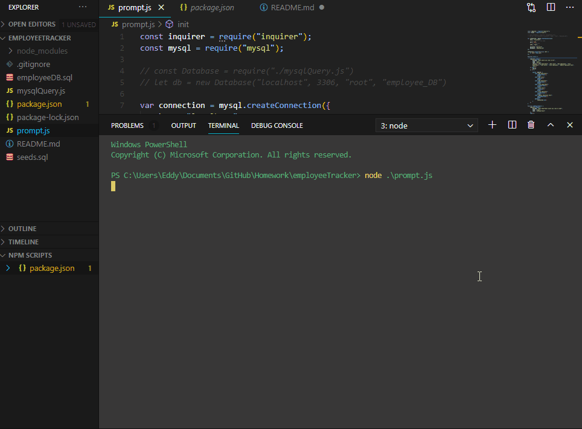

# Company Employee Tracker

### Table of Contents
- [Description](#description)
- [Installation](#installation)
- [License](#license)
- [Usage](#usage)
- [Test](#test)
- [Preview](#preview)


## Description
This command line application allows the user to quickly add, view, and update employees, roles, and departments within a company; and have the data stored in a SQL database. 

### Technology used:

- JS (ES6)
- node
- inquirer
- mysql

## Installation

Download the application and run

```
npm install
```
in the appropriate directory.

## License
MIT license

## Usage 

This application keeps track of employee using IDs to correlate the employee with the their role and department follwing this schematic:


## Test

After installation run 
``` 
node prompt
``` 
to test the application


## Preview 


